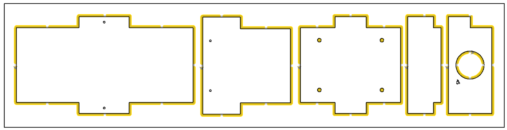
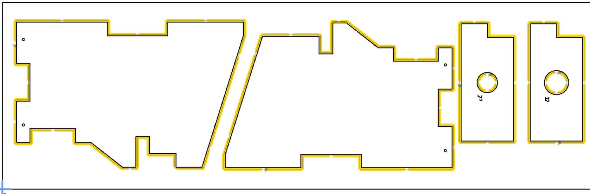
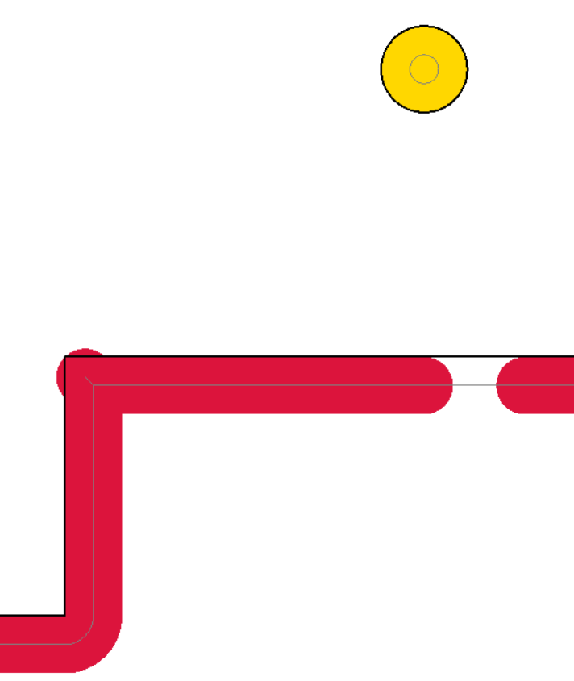
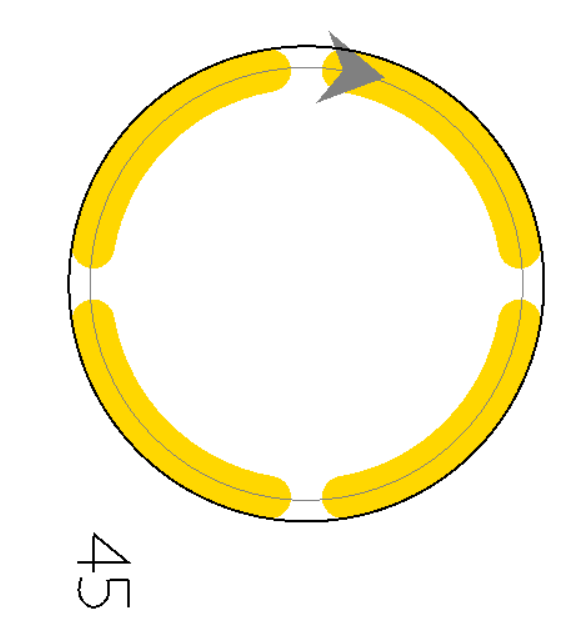

# CNC-Fräsen

(Beschreibung)

Mithilfe einer CNC-Fräsmaschine lassen sich sehr genaue und saubere Teile für den Vogelnistkasten fertigen.

(TEXT ERGÄNZEN ...)

## Fräswerkzeug

(TEXT - Fräsdurchmesser = 4 mm, Länge mind. 20 mm)

## Sicherheit

(TEXT)

## Fräs-Parameter

(TEXT - Parameter aus EstlCAM entnehmen)

## Schmales Brett (20 cm Breite)

Für das schmale Brett mit 20 cm Breite (800 x 200 x 18 mm) wird folgende Anordnung empfohlen:

Die SVG-Datei kann hier (LINK) heruntergeladen werden.

## Breites Brett (25 cm Breite)

Für das schmale Brett mit 20 cm Breite (800 x 250 x 18 mm) wird folgende Anordnung empfohlen:

Die SVG-Datei kann hier (LINK) heruntergeladen werden.

## Anbindung und freigefräste Ecken

Es wird empfohlen, alle Teile mit Stegen anzubinden und die Ecke freizufräsen (TEXT WEITER ERGÄNZEN)

Bilder:

  

 

## Nachbearbeitung

(TEXT)
