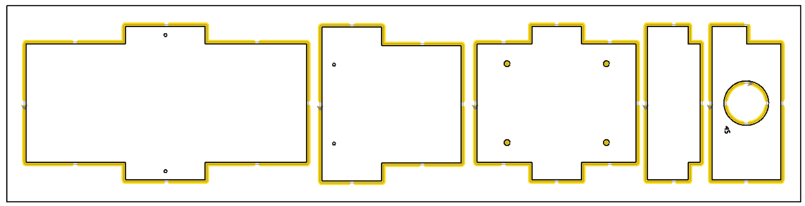

# CNC-Fräsen

Mit einer CNC-Fräse haben wir sehr gute und saubere Ergebnisse erzielt. Die CNC-Fräse sollte möglichst groß genug sein, um die 80 x 25 cm großen Bretter bearbeiten zu können, sodass alle Teile pro Brett in einem Durchgang gefräst werden können. Bei kleineren CNC-Maschinen müssten die Teile ggf. einzeln aus kleineren Brettern gefräst werden.

Wir haben eine CNC-Fräsmaschine vom Typ "WorkBee Z1+" von der Firma Ooznest verwendet, was sehr gut funktioniert hat.

Der Fräser sollte mindestens 18-22 mm lang sein, um die 18 mm dicken Bretter komplett durchfräsen zu können. Wir haben folgenden Fräser benutzt und damit sehr gute Erfahrungen gemacht: VHM Holzfräser, d=4, L=22 (C), Z=2, Blank

In Folgenden wird beispielhaft eine Möglichkeit für CNC-Fräsen beschrieben.

## Fräswerkzeug

Fräsdurchmesser = 4 mm, Länge mind. 20 mm, z.B.  VHM Holzfräser, d=4, L=22 (C), Z=2, Blank

## SVG-Dateien

Die 2D-SVG-Vektorgrafiken können [hier](../) heruntergeladen werden. Bei Bedarf können die Grafiken mit der kostenlosen Software Inkscape https://inkscape.org/ angepasst werden (z.B. Teile anders anordnen). 

## Software

Wir haben mit der Software Estlcam https://www.estlcam.de/ gute Erfahrungen gemacht. Mit dieser Software ist es relativ einfach möglich, 2D-SVG-Vektorgrafiken einzufügen und alle notwendigen Einstellungen und Fräsvorgänge einzurichten.

Es können auch andere Programme verwendet werden, auch 3D-basierte CAM-Programme. Hierfür kann in CAD-Datei (in [diesem Ordner](../../CAD)) in FreeCAD geöffnet und die Teile in FreeCAD oder einem anderen Programm für das CNC-Fräsen vorbereitet werden.  

## Fräs-Parameter

Wir haben in Estlcam unter "Werkzeugliste" folgenden Fräsen hinzugefügt:

- Name: Fräser 4 mm
- Durchmesser: 4 mm
- Tiefenzustellung je Durchgang: 2 mm
- Eintauchwinkel: 90 °
- Vorschubgeschwindigkeit: 1400 mm/min
- Eintauchgeschwindigkeit: 700 mm/min
- Drehzahl: 22000 upm

Die Drehzahleinstellung war in unserem Fall nicht relevant, weil bei der verwendeten CNC-Fräsmaschine der Fräser als separates Gerät in der Halterung sitzt und die Drehzahl nicht über die CAM-Software, sondern direkt am Fräser eingestellt wird.
Wir haben eine mittlere Drehzahl eingestellt. Da jede Fräsmaschine, jeder Fräser und jedes Holz anders ist, wird empfohlen, zunächst einige kleine, vorsichtige Test-Fräsungen durchzuführen und zu erproben, welche Drehzahl am besten funktioniert. Auch die anderen, oben stehenden Parameter können so erprobt und noch angepasst werden.

## Befestigung der Bretter

Die Bretter mit vier Schrauben an der Opferplatte der Fräsmaschine befestigen. Die Schrauben möglichst weit in der Ecke platzieren und nochmals nachmessen, ob für die geplanten Fräsauftrag eine Kollision mit den Schrauben ausgeschlossen werden kann. Ansonsten ggf. ein Bauteil aus der Datei entfernen und die Teile so verschieben, dass sie genug Abstand zu den Schrauben haben.

## Schmales Brett (20 cm Breite)

Für das schmale Brett mit 20 cm Breite (800 x 200 x 18 mm) wird folgende Anordnung empfohlen:

Die SVG-Datei kann [hier](../) heruntergeladen werden.

## Breites Brett (25 cm Breite)

Für das schmale Brett mit 20 cm Breite (800 x 250 x 18 mm) wird folgende Anordnung empfohlen:

Die SVG-Datei kann [hier](../) heruntergeladen werden.

## Fräsbahnen definieren

Zunächst müssen die Fräsbahnen definiert werden (siehe gelb markierte Bahnen in den Abbildungen oben). In Estlcam kann die Funktion "Teil" genutzt werden, um die Außenbahnen der Teile festzulegen. Für die Innenbahnen (Einflugloch in der Lochplatte sowie die vier Wasserablauflöcher im Boden) wird die Funktion "Ausschnitt" verwendet.

## Anbindung der Teile

Alle Teile sollten mit Stegen angebunden werden. In den Abbildungen oben sind die gelben Fräsbahnen an einigen Stellen unterbrochen. Es wird empfohlen, die Anbindestege an diesen Stellen zu platzieren. Eine andere Anordnung ist jedoch auch möglich, solange sichergestellt ist, dass die Teile beim ausfräsen einen sicheren Halt haben.

In Estlcam kann hierfür eine Fräsbahn ausgewählt und anschließend die Funktion "Anbinden" genutzt werden.

Hier noch ein Detailbild von der inneren Fräsbahn beim Einflugloch mit den vier Unterbrechungen (Stellen für die Anbindestege):

Die Zahl "45" (siehe oberes Bild) zeigt den Lochdurchmesser zur Orientierung an. Die Zahl sollte nicht gefräst werden (oder mit einem sehr kleinen Fräser "eingraviert" werden). Die Zahl kann nach dem Fräsen von Hand draufgeschrieben oder mit einem Lasercutter eingraviert werden.

## Ecken freifräsen

Damit die Teile später gut zusammenpassen, wir empfohlen, alle innenliegenden Ecken freizufräsen. Hintergrund ist, dass der Fräsen wegen seines runden Querschnitts innenliegende Ecken nicht ganz freifräsen kann, sondern immer eine Rundung mit dem Durchmesser des Fräsers übrig bleibt.

In Estlcam kann hierfür eine Fräsbahn ausgewählt und anschließend die Funktion "Freifräsen" genutzt werden.

Die folgenden zwei Abbildungen zeigen ein Beispiel für freigefräste Ecken. Im ersten Bild links sind die Ecken noch nicht freigefräst, im zweiten Bild rechts wurde "Freifräsen" korrekt hinzugefügt:

 

## Prüfung und CNC-Programm-Export

Abschließend sollte jede Fräsbahn nochmals ausgewählt und kontrolliert werden, ob die Parameter und der Fräser richtig eingestellt sind. Danach kann die Datei als über Datei > CNC-Programm speichern exportiert werden. Als Bauteilhöhe sollte die Brettdicke (18 mm) oder etwas mehr eingestellt werden.

## Nachbearbeitung

An den fertig gefrästen Teilen können die Haltestege vorsichtig mit einem stabilen Cuttermesser durchgeschnitten werden. Es können auch kleine Handsägen, Stichsägen oder andere Werkzeuge verwendet werden. Ggf. übrige Reste abschleifen oder feilen.

Die folgenden Abbildungen zeigen den Fräsvorgang sowie die Haltestege:

 

