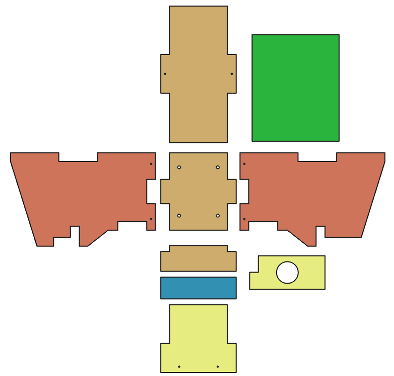

(Vorlagen für weitere Bearbeitung, kann später gelöscht werden):

Liste mit Stichpunkten:
- Punkt 1
- Punkt 2
  - Unterpunkt 2.1 (zwei Leerzeichen vor dem Spiegelstrich "-" hinzufügen)
  - Unterpunkt 2.2
- Punkt 3

Normaler Text **fettgedruckt** , _kursiv_ 

Bild:

Die Datei "Beispielbild.png" muss im Ordner "Documentation" liegen (über "Add file" oben rechts in der Ecke > Upload files > Commit Changes (ganz unten).
Wichtig: wenn "png" im Dateinamen klein geschrieben ist, muss es auch hier klein stehen. Entsprechend bei PNG groß auch hier groß schreiben.

Zum Speichern der Datei: Commit changes (oben rechts)

# Vogelhaus für Workshops (Name ggf. ändern) Bauanleitung

## Beschreibung
(Kurzer Einleitungstext, der das Vogelhaus beschreibt)

## Material- und Werkzeugliste

(Hier benötigte Materialien und Werkzeuge auflisten)

### Material/Bauteile

- 7x Holzteile (lasergeschnitten oder CNC-gefräst), davon eine Lochplatte mit Einflugloch
- 2x weitere Lochplatten mit unterschiedlichen Durchmessern
- 1x Frontplatte aus Recycling-Kunststoff
- 2x Halter aus Recycling-Kunststoff (oder drei Stück, falls die Lochplatte locker sitzt und gesichert werden muss)
- 1x Dach aus Recyclingkunststoff
- (ANZAHL) Schrauben vom Typ (SCHRAUBENTYP 1)
- (ANZAHL) Schrauben vom Typ (SCHRAUBENTYP 2)
- (ANZAHL) Schrauben vom Typ (SCHRAUBENTYP 3)
- 2x Schnur (jeweils ca. 15 cm lang) (Optional; Zur Sicherung der Frontklappe/Tür)

### Werkzeuge

- Akkuschrauber
- Passende Bits für Kreuzschlitz- und Torx-Schrauben
- Bohrer (DURCHMESSER)
- Schraubendreher (Kreuzschlitz und Torx) (Optional, falls kein Akkuschrauber zur Verfügung steht oder falls Schrauben von Hand angezogen werden sollen)
- 1-2 Schraubzwingen (optional, vereinfacht die Montage)
- Feile (falls Teile nicht passen und nachbearbeitet werden müssen)
- Raspel (zum Anrauen der Innenfläche der Frontplatte/Tür)
- Bohrmaschine (BOHRUNGEN evtl. in separates Dokument "Herstellung der Teile)

## Bauanleitung

(hier Bauanleitung beschreiben)

- Überprüfe, ob alle Teile vorhanden sind (vergleiche Bild unten)
- Die linke Wand und rechte Wand sehen etwas unterschiedlich aus - Stelle sicher, dass du sie richtig anordnest

- Stecke alle Teile zusammen und prüfe, ob sie gut zusammenpassen (folge der bebilderten Anleitung unten)
- Falls einzelne Teile nicht passen sollten, bearbeite die entsprechenden Ecken und Kanten nach (z.B. mit einer Feile)
- Wenn alles gut zusammenpasst, zerlege die Teile wieder

- Beginne nun mit den Teilen Boden, linke Wand, Rückwand und rechte Wand und stecke sie in dieser Reihenfolge zusammen
- Du kannst 1-2 Schraubzwingen benutzen, um die Teile vorläufig zusammenzuhalten

 

 

- Verwende 6 Schrauben (SCHRAUBENTYP), um die Teile an den vorgesehenen Bohrungen miteinander zu verbinden (nutze einen Akkuschrauber oder einen Schraubendreher)
- An den beiden Seitenteilen (links/rechts) sind ganz unten jeweils zwei Bohrungen; An der Rückwand sind auf mitterer Höhe zwei Bohrungen

 

- (Beschreibung hinzufügen)

  

- (Beschreibung hinzufügen)

 

- (Beschreibung hinzufügen)
