# Vogelnistkasten für Workshops - Bauanleitung

## Beschreibung
(Kurzer Einleitungstext, der das Vogelhaus beschreibt)

## Bauteile anfertigen

Bevor der Nistkasten nach dieser Anleitung zusammengebaut wird, sollten die Teile alle angefertigt werden.

Falls du das noch nicht gemacht hast, gehe [zurück zur Übersicht](../README.md) und bearbeite die Punkte: "Holzteile anfertigen", "Kunststoffteile anfertigen" und "Kaufteile".

## Material- und Werkzeugliste

### Material/Bauteile

Schrauben:
- 6 x Holzschrauben vom Typ 4 x 30 
- 12 x Holzschrauben vom Typ 3,5 x 25
- 2 x Holzschrauben vom Typ 4 x 40

:bulb: Alle Schrauben möglichst mit Senkkopf (Kreuzschlitz oder Torx). Schraubengrößen können auch leicht abweichen.

Lasergeschnittene bzw. CNC-gefräste Holzteile:
- 7x Holzteile (lasergeschnitten oder CNC-gefräst), davon eine Lochplatte mit Einflugloch
- 2x weitere Lochplatten mit unterschiedlichen Durchmessern

Zugesägte Teile aus Recycling-Kunststoff:

- 1x Frontplatte aus Recycling-Kunststoff
- 2x Halter aus Recycling-Kunststoff (oder drei Stück, falls die Lochplatte locker sitzt und gesichert werden muss)
- 1x Dach aus Recyclingkunststoff
- 1x Plastikbrett für die Rückseite (Baumbefestigung) aus Recyclingkunststoff

Sonstiges:
- 2x Schnur (jeweils ca. 15 cm lang) (Optional, geht auch ohne - zur Sicherung der Frontklappe/Tür)

### Werkzeuge

- Akkuschrauber
- Passende Bits für Kreuzschlitz- und/oder Torx-Schrauben (je nach verwendeter Schrauben)
- Bohrer 3 mm Durchmesser
- Schraubendreher (Kreuzschlitz und/oder Torx) (Optional, falls kein Akkuschrauber zur Verfügung steht oder falls Schrauben von Hand angezogen werden sollen)
- 1-2 Schraubzwingen (optional, vereinfacht die Montage)
- Feile (falls Teile nicht passen und nachbearbeitet werden müssen)
- Raspel (zum Anrauen der Innenfläche der Frontplatte/Tür)
- Standbohrmaschine (falls sich herausstellt, dass noch irgendwo noch Bohrungen fehlen - eigentlich anzufertigen im Abschnitt xxx)

## Bauanleitung

Vorbereitung:

- Überprüfe, ob alle Teile vorhanden sind (vergleiche Bild unten - nicht alle Teile sind in dem Bild zu sehen, aber die Teile im Bild werden zuerst benötigt)
- Die linke Wand und rechte Wand sehen etwas unterschiedlich aus - Stelle sicher, dass du sie richtig anordnest

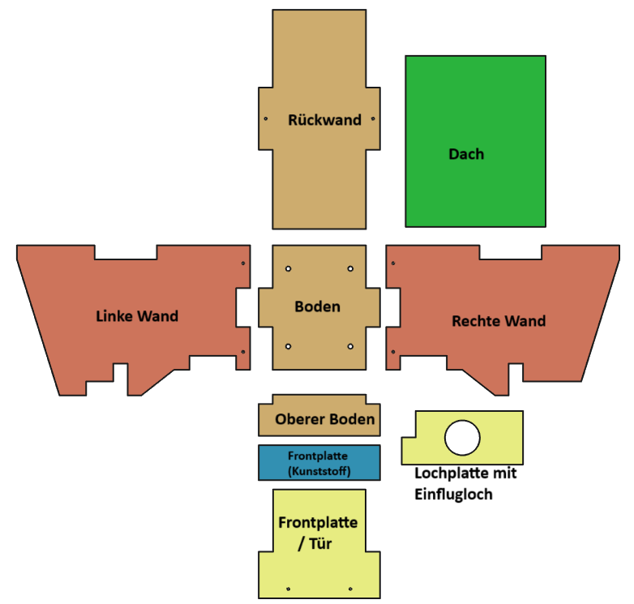

- Stecke alle Holzteile zusammen (zunächst ohne Schrauben, nur lose zusammenstecken) und prüfe, ob alle Teile gut zusammenpassen (folge der bebilderten Anleitung unten)
- Falls einzelne Teile nicht passen sollten, bearbeite die entsprechenden Ecken und Kanten nach (z.B. mit einer Feile)
- Wenn alles gut zusammenpasst, zerlege die Teile wieder

Anrauen der Frontplatte/Tür:

- Die Frontplatte/Tür muss von einer Seite angeraut werden, damit die Jungvögel daran hochklettern können (wichtig!)
  - Entscheide, welche Seite der Frontplatte/Tür auf die Innenseite soll
  - Raue die Fläche mit der Raspel gründlich an
  - Zusätzlich kannst du einen breiten Schraubendreher benutzen, um einige Rillen in die Fläche zu schlagen

Zusammenbau:

- Beginne nun mit den Teilen Boden, linke Wand, Rückwand und rechte Wand und stecke sie in dieser Reihenfolge zusammen
- Du kannst 1-2 Schraubzwingen benutzen, um die Teile vorläufig zusammenzuhalten
  Verwende 6 Holzschrauben vom Typ 4 x 30, um die Teile an den vorgesehenen Bohrungen miteinander zu verbinden (nutze einen Akkuschrauber oder einen Schraubendreher)
- An den beiden Seitenteilen (links/rechts) sind ganz unten jeweils zwei Bohrungen; An der Rückwand sind auf mitterer Höhe zwei Bohrungen (siehe Bilder unten)

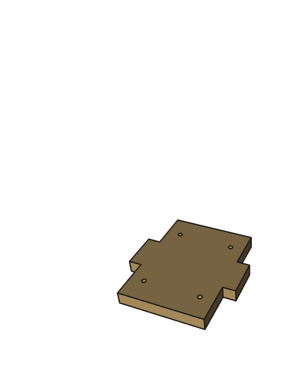 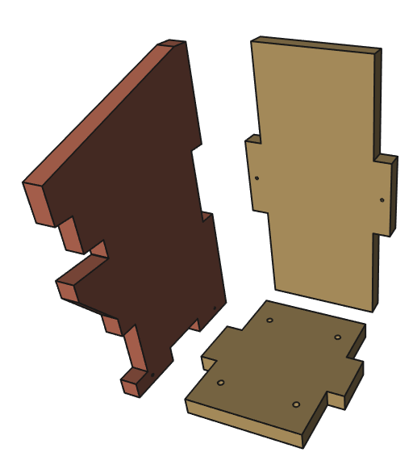

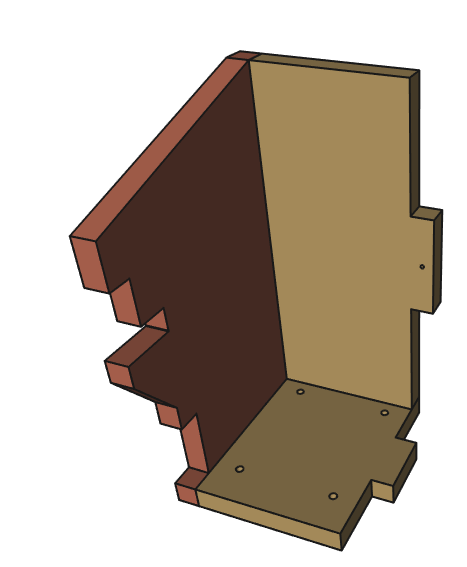 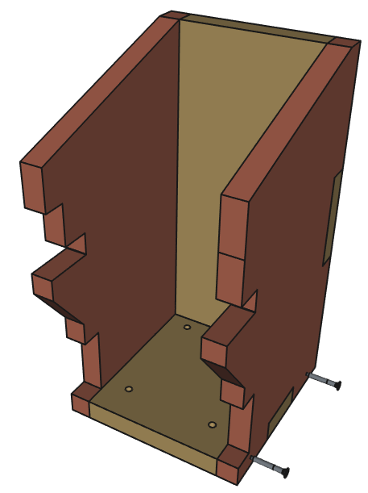

- Setze das Teil "Oberer Boden" in die Lücke ein (siehe Bild unten) und stelle sicher, dass es hineinpasst. Falls nicht, feile etwas nach.

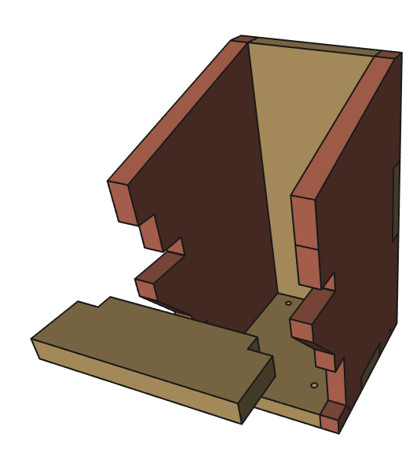 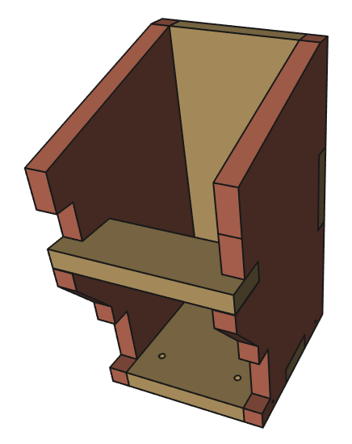

- Bohre an den markierten Stellen (Bild unten) zwei Bohrungen
  - Verwende einen Akkuschrauber mit 3 mm Bohrer
  - Die Bohrungen einfach mittig auf der Fläche platzieren oder verwende die Frontplatte aus Recyclingkunststoff als Schablone zum Anzeichnen
  - Es reicht, wenn die Löcher ungefähr so tief sind wie die Schraubenlänge (ca. 2,5 cm) 

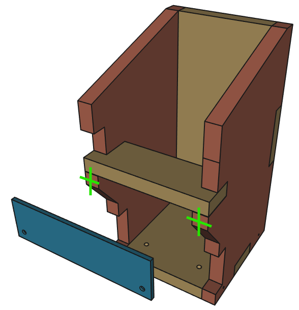

- Befestige die Frontplatte aus Recyclingkunststoff (im Bild blau) am Nistkasten. Verwende dafür zwei Holzschrauben 3,5 x 25 und die beiden vorgebohrten Löcher
- Nimm eine Lochplatte mit Einflugloch und schiebe sie seitlich in die Halterung
  - Falls die Platte nicht hineinpasst, lockere die beiden Schrauben an der Frontplatte ein wenig
  - Falls die Platte sehr leicht reingeht und keinen festen Sitz hat, kannst du die Schrauben etwas fester anziehen
  - Stelle sicher, dass die Lochplatte gut einschiebbar ist, aber trotzdem einen möglichst festen Sitz hat und nicht hinausrutscht
 
  :bulb: Falls es nicht möglicht ist, den Sitz der Lochplatte festzubekommen und sie leicht herausrutscht, kannst du auch eine zusätzliche Drehhalterung montieren - mehr dazu ganz am Ende der Anleitung. 

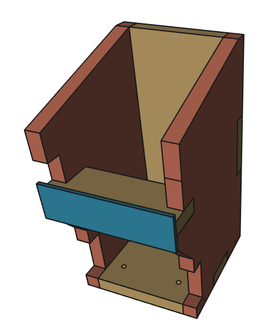 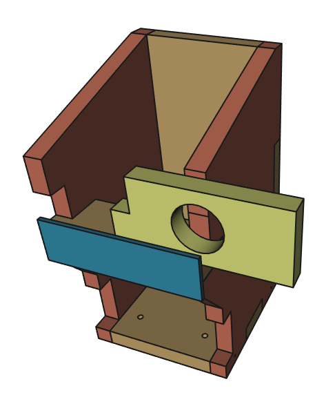 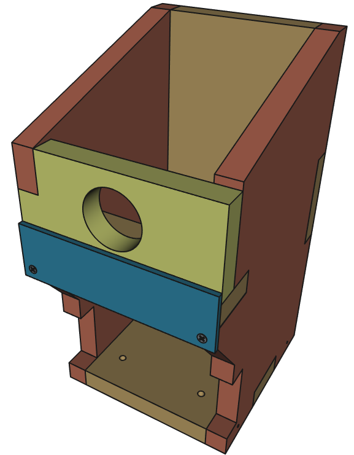

- (Beschreibung hinzufügen)

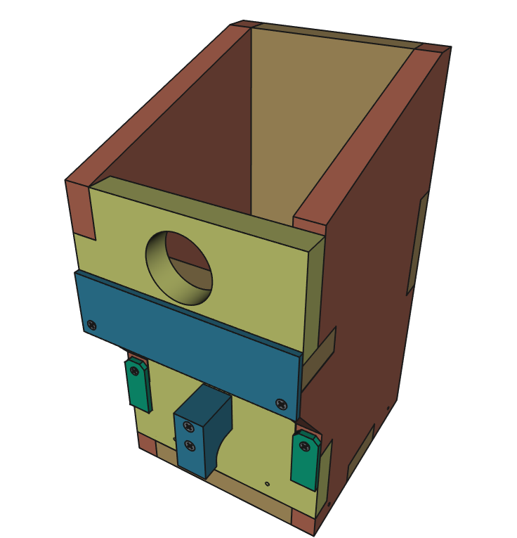 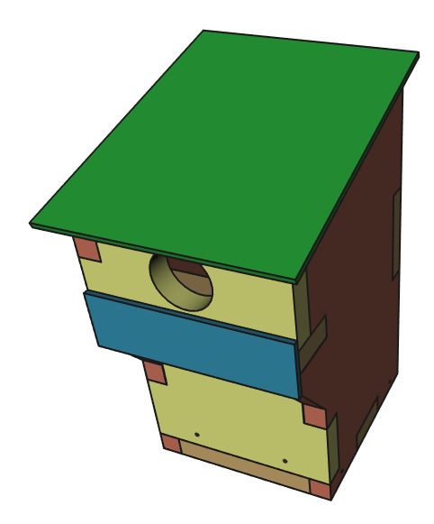

- (Beschreibung hinzufügen)
