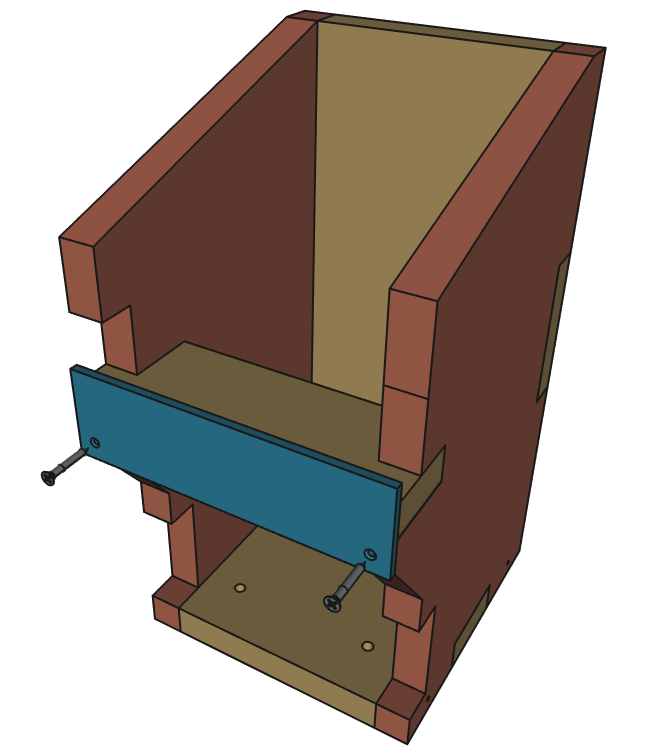
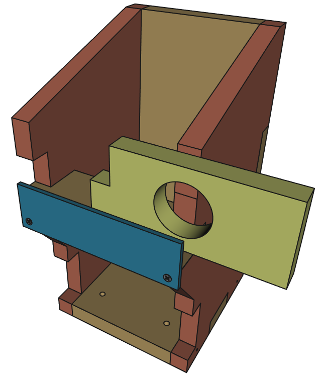
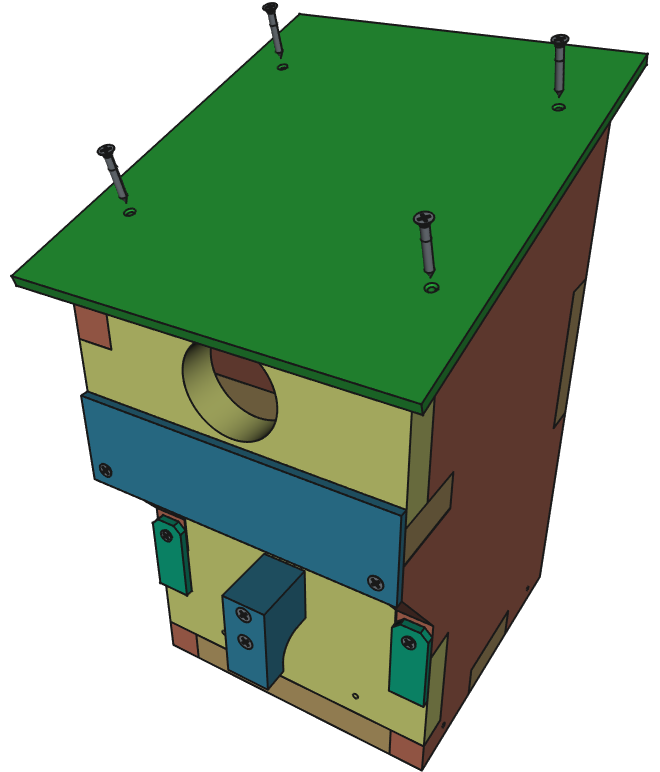

# Vogelnistkasten für Workshops - Bauanleitung

## Bauteile anfertigen

Bevor der Nistkasten nach dieser Anleitung zusammengebaut wird, sollten die Teile alle angefertigt werden.

Falls du das noch nicht gemacht hast, gehe [zurück zur Übersicht](../README.md) und bearbeite die Punkte: "Fertigung der Holzteile", "Fertigung der Kunststoffteile" und besorge die Teile von der "Einkaufsliste".

## Material- und Werkzeugliste

### Material/Bauteile

Schrauben:
- 6 x Holzschrauben vom Typ 4 x 30 
- 12 x Holzschrauben vom Typ 3,5 x 25
- 2 x Holzschrauben vom Typ 4 x 40

:bulb: Alle Schrauben möglichst mit Senkkopf (Kreuzschlitz oder Torx). Schraubengrößen können auch leicht abweichen.

Lasergeschnittene bzw. CNC-gefräste Holzteile:
- 7x Holzteile (lasergeschnitten oder CNC-gefräst), davon eine Lochplatte mit Einflugloch
- 2x weitere Lochplatten mit unterschiedlichen Durchmessern

Zugesägte Teile aus Recycling-Kunststoff:

- 1x Frontplatte aus Recycling-Kunststoff
- 2x Halter aus Recycling-Kunststoff (oder drei Stück, falls die Lochplatte locker sitzt und gesichert werden muss)
- 1x Dach aus Recyclingkunststoff
- 1x Plastikbrett für die Rückseite (Baumbefestigung) aus Recyclingkunststoff

Sonstiges:
- 2x Schnur (jeweils ca. 15 cm lang) (Optional, geht auch ohne - zur Sicherung der Frontklappe/Tür)

### Werkzeuge

- Akkuschrauber
- Passende Bits für Kreuzschlitz- und/oder Torx-Schrauben (je nach verwendeter Schrauben)
- Bohrer 3 mm Durchmesser
- Schraubendreher (Kreuzschlitz und/oder Torx) (Optional, falls kein Akkuschrauber zur Verfügung steht oder falls Schrauben von Hand angezogen werden sollen)
- 1-2 Schraubzwingen (optional, vereinfacht die Montage)
- Feile (falls Teile nicht passen und nachbearbeitet werden müssen)
- Raspel (zum Anrauen der Innenfläche der Frontplatte/Tür)
- Standbohrmaschine (falls sich herausstellt, dass noch irgendwo noch Bohrungen fehlen - eigentlich anzufertigen im Abschnitt xxx)

## Bauanleitung

Vorbereitung:

- Überprüfe, ob alle Teile vorhanden sind (vergleiche Bild unten - nicht alle Teile sind in dem Bild zu sehen, aber die Teile im Bild werden zuerst benötigt)
- Die linke Wand und rechte Wand sehen etwas unterschiedlich aus - Stelle sicher, dass du sie richtig anordnest

- Stecke alle Holzteile zusammen (zunächst ohne Schrauben, nur lose zusammenstecken) und prüfe, ob alle Teile gut zusammenpassen (folge der bebilderten Anleitung unten)
- Falls einzelne Teile nicht passen sollten, bearbeite die entsprechenden Ecken und Kanten nach (z.B. mit einer Feile)
- Wenn alles gut zusammenpasst, zerlege die Teile wieder

Anrauen der Frontplatte/Tür:

- Die Frontplatte/Tür muss von einer Seite angeraut werden, damit die Jungvögel daran hochklettern können (wichtig!)
  - Entscheide, welche Seite der Frontplatte/Tür auf die Innenseite soll
  - Raue die Fläche mit der Raspel gründlich an
  - Zusätzlich kannst du einen breiten Schraubendreher benutzen, um einige Rillen in die Fläche zu schlagen

Zusammenbau:

- Beginne nun mit den Teilen Boden, linke Wand, Rückwand und rechte Wand und stecke sie in dieser Reihenfolge zusammen
- Du kannst 1-2 Schraubzwingen benutzen, um die Teile vorläufig zusammenzuhalten
  Verwende 6 Holzschrauben vom Typ 4 x 30, um die Teile an den vorgesehenen Bohrungen miteinander zu verbinden (nutze einen Akkuschrauber oder einen Schraubendreher)
- An den beiden Seitenteilen (links/rechts) sind ganz unten jeweils zwei Bohrungen; An der Rückwand sind auf mitterer Höhe zwei Bohrungen (siehe Bilder unten)

 

 

- Setze das Teil "Oberer Boden" in die Lücke ein (siehe Bild unten) und stelle sicher, dass es hineinpasst. Falls nicht, feile etwas nach.

 

- Bohre an den markierten Stellen (Bild unten) zwei Bohrungen
  - Verwende einen Akkuschrauber mit 3 mm Bohrer
  - Die Bohrungen einfach mittig auf der Fläche platzieren oder verwende die Frontplatte aus Recyclingkunststoff als Schablone zum Anzeichnen
  - Es reicht, wenn die Löcher ungefähr so tief sind wie die Schraubenlänge (ca. 2,5 cm) 

- Befestige die Frontplatte aus Recyclingkunststoff (im Bild blau) am Nistkasten. Verwende dafür zwei Holzschrauben 3,5 x 25 und die beiden vorgebohrten Löcher
- Nimm eine Lochplatte mit Einflugloch und schiebe sie seitlich in die Halterung
  - Falls die Platte nicht hineinpasst, lockere die beiden Schrauben an der Frontplatte ein wenig
  - Falls die Platte sehr leicht reingeht und keinen festen Sitz hat, kannst du die Schrauben etwas fester anziehen
  - Stelle sicher, dass die Lochplatte gut einschiebbar ist, aber trotzdem einen möglichst festen Sitz hat und nicht hinausrutscht
 
  :bulb: Falls es nicht möglicht ist, den Sitz der Lochplatte festzubekommen und sie leicht herausrutscht, kannst du auch eine zusätzliche Drehhalterung montieren - mehr dazu ganz am Ende der Anleitung. 

  

Frontplatte / Tür + Griff:

- Platziere den Griff mittig auf der Frontplatte/Tür
  - Achte darauf, dass du den Griff auf der glatten Seite platzierst und nicht auf der angerauten Seite. Die angeraute seite soll auf der Innenseite des Nistkastens liegen
- Befestige den Griff mit zwei Schrauben 4 x 40. Wenn nötig, versenke die Schrauben etwas tiefer, sodass sie genug Halt im Holz haben

 

 - Setze die Tür in den Nistkasten ein
- Bohre an den markierten Stellen (Bild unten) zwei Bohrungen
  - Verwende einen Akkuschrauber mit 3 mm Bohrer
  - Die Bohrungen einfach mittig auf der Fläche platzieren oder verwende die beiden drehbaren Halter aus Recyclingkunststoff als Schablone zum Anzeichnen
  - Es reicht, wenn die Löcher ungefähr so tief sind wie die Schraubenlänge (ca. 2,5 cm)
 
 

- Wichtig: Stelle sicher, dass du die drehbaren Halter so platzierst, dass sie
  - im geschlossenen Zustand die Tür festhalten
  - im geöffneten Zustand die Tür nicht blockieren

 

Dach:

- Platziere das Dach mittig auf die Oberseite des Nistkastens
- Achte darauf, dass das Dach hinten nicht übersteht, weil da später noch das Plastikbrett für die rückseitige Befestigung dran muss (siehe Bild unten, grüner Rahmen und grüner Pfeil)
- Verwende 4x Holzschrauben vom Typ 3,5 x 25 zum Befestigen des Dachs

  

Plastikbrett Rückseite:

- Platziere das Plastikbrett mittig auf der Rückseite des Nistkastens
- Verwende 4x Holzschrauben vom Typ 3,5 x 25 zum Befestigen des Plastikbretts

 

:bulb: Das Brett dient als Baumbefestigung. Die beiden Löcher ganz oben und unten im Plastikbrett bleiben vorerst frei. Bei der Befestigung am Baum werden Alunägel durch die Löcher geschlagen. 

Schnüre (optional):

- Die Frontplatte/Tür kann zusätzlich mit zwei ca. 15 cm langen Schnüren gesichert werden
- Vorteil: Sobald der Nistkasten hoch im Baum hängt und die Tür geöffnet wird (zur Reinigung), kann sie nicht hinunterfallen bzw. muss man die Tür nicht die ganze Zeit in der Hand halten, sondern kann sie an den Schnüren hängen lassen
- Die Schnüre einfach durch die Löcher in der Tür und im Boden führen (gelbe Linien im Bild unten) und festknoten

Zusätzliche drehbare Halterung (nur, falls notwendig):

- Falls eine der Lochplatten nicht gut hält und leicht herausrutscht, kann sie durch einen zusätzlichen drehbaren Halter gesichert werden (siehe Bild)

Der Nistkasten ist nun bereit zum Aufhängen. Hier geht es [zurück zur Übersicht](../README.md), dort weiter mit Punkt 6 "Aufhängung der Kästen und Pflege".
