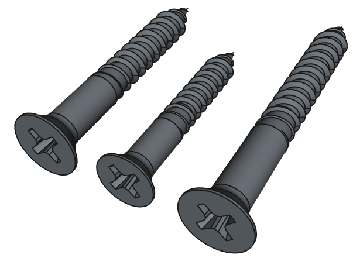
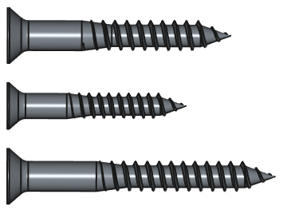

# Einkaufsliste

Die Mengenangaben in dieser Einkaufsliste beziehen sich auf **einen** Nistkasten. Falls mehrere Nistkästen gebaut werden sollen, können natürlich entsprechend größere Mengen besorgt werden

**Zum Thema Holz:**

Der NABU empfiehlt zum Thema Holzart folgendes:

_"Verwenden Sie zum Bau von Nistkästen 1,8 Zentimeter dicke, ungehobelte Bretter aus Massivholz. Eiche, Robinie und Lärche oder Kiefer eignen sich am besten. Falls Ihnen diese Holzarten nicht zur Verfügung stehen, können Sie auch auf Fichte und Tanne zurückgreifen. Sperrholz oder Pressplatten sind nicht witterungsbeständig und daher für den Außeneinsatz ungeeignet."_

- Quelle: https://www.nabu.de/tiere-und-pflanzen/voegel/helfen/nistkaesten/index.html , Abschnitt "Das richtige Material"

Für unsere Zwecke haben wir uns für Fichtenholzbretter aus dem Baumarkt entschieden, da sie einen gutes Verhältnis aus Kosten und Eignung bieten. Zudem haben wir in unseren Tests festgestellt, dass sich Fichtenholzbretter gut mit dem Lasercutter schneiden bzw. mit der CNC-Fräse fräsen lassen. Es können aber, entsprechend der oben stehenden Empfehlungen, auch andere Holzarten verwendet werden.

**Zum Thema Recyclingkunststoff:**

Die Offene Recycling-Werkstatt vom insel e.V. Hamburg verfügt über Maschinen, mit denen sich Platten und Balken (sogenannte "Beams") aus Recyclingkunststoff herstellen lassen. Die Maschinen und Verfahren basieren auf dem "Precious Plastic"-Projekt https://www.preciousplastic.com/ (daher stammt auch der englischsprachige Begriff "Beam" - die Platten werden auf englisch "Sheets" genannt).

Die Platten und Balken können, falls die notwendigen Maschinen vorhanden sind, selbst hergestellt werden. Sie können auch beim insel e.V. https://werkstatt.insel-ev.de/ oder auf dem "Precious Plastic Bazar" https://bazar.preciousplastic.com/ bestellt werden. Als Kunststoffsorte kommen sowohl PP als auch HDPE (PE) in Frage.

Für die genauen Maße der Kunststoffteile können auch die technischen Zeichnungen in der Sektion "Fertigung der Kunststoffteile" eingesehen werden: (LINK)

**Zum Thema Schrauben:**

Die unten angegebenen Schraubengrößen können auch leicht abweichen, solange sie einerseits einen sicheren Halt bieten und andererseits nicht zu weit aus dem Material herausragen.

## Schrauben

- 6 x Holzschrauben vom Typ 4 x 30 
- 12 x Holzschrauben vom Typ 3,5 x 25
- 2 x Holzschrauben vom Typ 4 x 40

:bulb: Alle Schrauben möglichst mit Senkkopf (Kreuzschlitz oder Torx). Schraubengrößen können auch leicht abweichen. Abbildungen unten nur zur Orientierung, Aussehen der Schrauben kann auch abweichen.

 

## Holz

- 1x Brett 80 x 20 x 1,8 cm aus Fichtenholz
- 1x Brett 80 x 25 x 1,8 cm aus Fichtenholz

## Kunststoffplatten

- Eine oder mehrere Platten aus Recyclingkunststoff, sodass sich folgende Teile herstellen lassen:
  - 1x Frontplatte 156 x 45 mm (Stärke: 4 bis 5 mm)
  - 3x drehbarer Halter 45 x 18 mm (Stärke 4 bis 5 mm)
  - Dach 220 x 180 mm (Stärke: 5 bis 8 mm)
  - Brett Rückseite 440 x 85 mm (Stärke: 9 bis 10 mm)

Es können also beispielsweise folgende Platten besorgt werden:
- Stärke 4-5 mm, Länge/Breite mindestens 280 x 220 mm 
- Stärke 9-10 mm, Länge/Breite mindestens 440 x 85 mm

## Kunststoffbalken ("Beams")

Ein Stück 48 x 33 x 23 mm, abgeschnitten von einem Kunststoff-Balken ("Beam")

## Aluminiumnägel

Für die Befestigung der Nistkästen an Bäumen sollten pro Nistkasten zwei Alunägel verwendet werden. Mehr zum Thema im Abschnitt 6 "Aufhängung der Kästen und Pflege"

- 2x Alunägel 4,5 x 60 oder 4,5 x 80

Hier geht es [zurück zur Übersicht](../../README.md), dort weiter mit Punkt 3 "Fertigung der Holzteile (Lasercutting oder CNC-Fräsen)".
