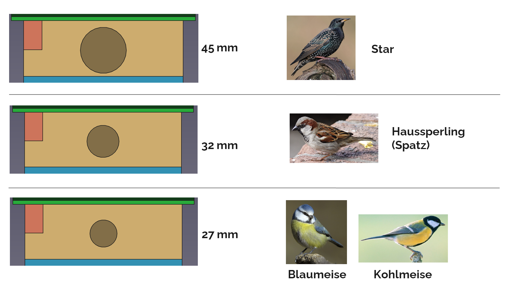

# Hintergrundinfos

Dieser Vogelnistkasten wurde im Rahmen eines Projekts bei der Offenen-Recycling-Werkstatt (beim insel e.V.) in Hamburg https://werkstatt.insel-ev.de/ entwickelt. Die "Deutsche Stiftung für Engagement und Ehrenamt" hat das Projekt gefördert. Projektzeitraum war von November 2023 bis Dezember 2024.

Der Nistkasten ist für verschiedene Höhlenbrüter-Vogelarten geeignet.

Im Rahmen des Projekts sind noch andere Nistkastenmodelle entstanden. Eine Übersicht befindet sich hier (LINK)

## Besonderheiten des Nistkastens

Ziel der Produktentwicklung war es, einen Nistkasten zu entwickeln, der
1. möglichst aus nachhaltigen Materialien hergestellt werden kann
2. einfach zusammenzubauen ist (auch von Kindern, z.B. im Rahmen von Bauworkshops)
3. mit wenig Aufwand in großer Stückzahl herstellbar ist, d.h. unter Verwendung von digitalen Fertigungsmaschinen wie Lasercutter oder CNC-Fräsen
4. gut dokumentiert ist, damit andere Menschen den Kasten nachbauen oder sogar verbessern oder neue Varianten entwickeln können
5. gut reparierbar und recyclebar ist
6. einen hohen Nutzen für die Vögel und für die Förderung von Artenvielfalt bietet

### Zu Punkt 1: Nachhaltige Materialien

Eine Besonderheit der Offene Recycling-Werkstatt, betrieben vom insel e.V. in Hamburg, besteht in Form von Werkzeugen und Prozessen zum Recycling von Kunststoffen (Plastik) und Herstellung von neuen Produkten aus Recyclingplastik. Die Werkstatt verfügt u.a. über Granulatmühlen (Schredder) zum Zerkleinern von Kunststoffabfällen sowie über eine Plattenpresse. Das zerkleinerte Plastikgranulat kann in der Plattenpresse zu großen Platten aus Recyclingplastik gepresst werden. Diese Platten können anschließend weiterverarbeitet werden, z.B. mit Tischkreissägen oder Bohrmaschinen. 

Daher bestand ein Ziel darin, die Vogelnistkästen, zumindest teilweise, aus Recyclingkunststoff herzustellen. Während der Konzeptionsphase stellte sich heraus, dass ein Vogelnistkasten nicht vollständig aus Plastik bestehen sollte (dies auch dank der Beratung durch die teilnehmenden NABU-Mitglieder). Plastikkästen heizen sich in der Sonne zu stark auf, was den Vögeln schadet, zudem ist Plastik (im Gegensatz zu Holz) nicht atmungsaktiv und es sammelt sich Feuchtigkeit im Innenraum.

Aus diesem Grund wurde ein Modell entwickelt, das teilweise aus Holz und teilweise aus Plastik besteht. Die Wände und der Boden sind aus Holz, sodass sich der Kasten nicht zu stark aufheizt, atmungsaktiv ist und zudem den Jungvögeln gute Klettermöglichkeiten an den Innenflächen bietet. Das Dach und einige weitere Verbindungsteile hingegen wurden aus Recyclingkunststoff gefertigt. Diese haben keine negativen Einflüsse auf das Innenklima. Gleichzeitig sorgt der Einsatz von Recyclingkunststoff dafür, dass wertvolles Holz zumindest teilweise eingespart werden kann. Zudem wird Kunststoffabfällen ein "zweites Leben" gegeben, oder - falls das Plastik erneut recycelt wird - sogar mehrere Leben.

### Zu Punkt 2: Einfacher Zusammenbau

Alle Teile und das gesamte Design wurden so entworfen, dass der Zusammenbau sehr einfach ist. Die Teile sind ähnlich wie ein Puzzle geformt, sodass sie sich einfach und eindeutig zusammenstecken lassen. Dadurch ist auch sichergestellt, dass die Teile richtig sitzen, nicht verrutschen und rechtwinkling zueinander angeordnet sind. Die Stellen, an denen Schrauben befestigt werden müssen, sind durch das Lasercutting bzw. CNC-Fräsen bereits vorgefertigt.

Somit ist der Kasten so konzipiert, dass er im Rahmen von Bauworkshops (ca. 1,5 Stunden) einfach zusammengebaut werden kann, auch von Grundschulkindern. Die Bauworkshops sollten von eingewiesenen Personen angeleitet werden. Die Bauanleitung kann verwendet werden, um Menschen in die Workshopleitung einzuweisen oder für handwerklich erfahrene Personen, die den Nistkasten ohne anleitende Workshopleiter alleine nachbauen möchten.

Der einfache Zusammenbau sorgt nicht zuletzt dafür, dass der Kasten wahrscheinlich recht häufig und in großer Stückzahl nachgebaut werden kann und somit einen möglichst großen Nutzen für den Tierschutz und die Artenvielfalt bringt.

### Zu Punkt 3: Einfache Herstellung in großer Stückzahl / Digitale Fertigung

Ein Produkt, bei dem die Einzelteile nur mit viel Aufwand einzeln von Hand gefertigt werden müssen, hat nur einen geringen Effekt, da es unwahrscheinlicher wird, dass überhaupt viele Produkte entstehen.

Dieser Nistkasten hingegen wurde so konzipiert, dass sich alle wichtigen Teile mithilfe von digitaler Fertigung praktisch "halbautomatisch" herstellen lassen. Alle Holzteile (und prinzipiell auch die Plastikteile) können mit einem Lasercutter oder einer CNC-Fräse mit wenig Zeit- und Personalaufwand hergestellt werden. Dadurch ist es möglich, relativ große Stückzahlen herzustellen. Auch dadurch können mehr Nistkästen entstehen und der Nutzen für Tierschutz und Artenvielfalt wird erhöht.

### Zu Punkt 4: Dokumentation

Der Nistkasten wurde gründlich dokumentiert. Alle wichtigen Infos rund um Materialbeschaffung, Fertigung, Zusammenbau und Verwendung des Nistkastens sind in diesem GitHub-Verzeichnis dokumentiert. Zudem sind alle digitalen Dateien, die zur Fertigung mit Lasercutter oder CNC-Fräse notwendig sind, beigelegt. Auch Zeichnungen und Anweisungen zur Herstellung einzelner Teile sind vorhanden.

Das Projekt ist als Open-Source-Hardware veröffentlicht, sodass jede:r diesen Nistkasten einsehen, nachbauen oder sogar verbessern oder verändern kann.

### Zu Punkt 5: Reparierbarkeit und Recyclebarkeit

Der Nistkasten wurde so designt, dass sich alle Teile wieder einfach voneinander lösen lassen. Es gibt keine Klebverbindungen, nur Steck- und Schraubverbindungen. Damit lässt sich der Nistkasten sehr gut reparieren, da Einzelteile einfach austauschbar sind. Zudem lassen sich alle Einzelteile sortenrein trennen und damit auch recyceln oder anderswo wiederverwenden.

### Zu Punkt 6: Nutzen für Vögel/Artenvielfalt

Dadurch, dass die wesentlichen Teile aus Holz bestehen, bietet der Nistkasten ein gutes Innenklima für (Jung)vögel. Der Kasten ist dank der Schraubverbindungen sehr stabil, auch bei Wind und Wetter. Durch die austauschbaren Lochplatten können verschiedene Vogelarten angesprochen werden. Falls andere Vogelarten unterstützt werden sollen oder falls sich herausstellt, dass die ursprünglich vorgesehe Vogelart gar nicht in der Gegend verkehrt, kann einfach eine Lochplatte mit anderem Lochdurchmesser eingeschoben werden. Es muss also kein neuer Kasten gebaut, sondern nur die Platte ausgetauscht werden, was den Kasten zusätzlich nachhaltig macht.

Zudem verfügt der Nistkasten über einen sogenannten Prädatorenschutz, also Schutz vor Nesträubern. Tiere wie Katzen, Marder oder Waschbären greifen manchmal in Nistkästen hinein und versuchen Eier oder Jungvögel herauszuholen. Der Schutz vor Nesträubern bei diesem Nistkasten besteht in Form der Abstufung im oberen Bereich beim Einflugloch. Das Bauteil "oberer Boden" sorgt dafür, dass die Wand mit dem Einflugloch ein Stück weit vorgezogen ist, sodass die hineingreifenden Nesträuber den unteren Bereich des Nistkastens, wo das Nest liegt, nicht erreichen können.

## Vogelarten und Einfluglochgrößen

Je nachdem, von welcher Vogelart der Nistkasten genutzt werden soll, kann eine andere Lochscheibe verwendet werden.

Zum einen kann man sich daran orientieren, welche Vogelart in der Gegend besonders gefährdet ist und unterstützt werden soll. Andererseits kann es aber auch sinnvoll sein, zu beobachten, welche Vögel überhaupt in der Gegend verkehren, sodass der Nistkasten für diese Vögel angepasst wird.

Falls man sich unsicher ist und sowieso mehrere Nistkästen aufhängt, kann man verschiedene Lochgrößen ausprobieren (jeden Nistkasten mit einem anderen Loch) und beobachten, welche Kästen gut angenommen werden und die anderen Kästen entsprechend mit der gleichen Lochplatte ausstatten.

Übliche empfohlene Lochgrößen je nach Vogelart sind in der folgenden Tabelle zu sehen:

| Art | Optimales Einflugloch (Durchmesser) |
| ------------- | ------------- |
| Blaumeise | 26-28 mm  |
| Tannenmeise  | 26-28 mm  |
| Haubenmeise  | 26-28 mm  |
| Sumpfmeise  | 26-28 mm  |
| Weidenmeise  | 26-28 mm  |
| Kohlmeise  | 32 mm  |
| Kleiber  | 32 - 45 mm  |
| Trauerschnäpper  | 32 - 34 mm  |
| Haussperling (Spatz)  | 32 - 34 mm  |
| Feldsperling (Spatz) | 32 mm |
| Star | 45 mm  |
| Gartenrotschwanz | oval: 48 mm hoch, 32 mm breit  |

Quelle: NABU - https://www.nabu.de/tiere-und-pflanzen/voegel/helfen/nistkaesten/01083.html

Für diesen Nistkasten wurden drei verschiedene Lochgrößen entworfen: 27 mm, 32 mm und 45 mm. Damit lassen sich fast alle Vogelarten in der oben stehenden Tabelle abdecken.

Ein Vorschlag für einige ausgewählte Vogelarten ist in folgendem Bild zu sehen:

Für den ersten Zusammenbau im Bauworkshop kann zunächst eine beliebige Lochplatte verwendet werden. Die anderen beiden Lochplatten kann man ebenfalls herstellen und mitnehmen, um sie später je nach Bedarf austauschen zu können.

Hier geht es [zurück zur Übersicht](../../README.md), dort weiter mit Punkt 2 "Einkaufsliste".
