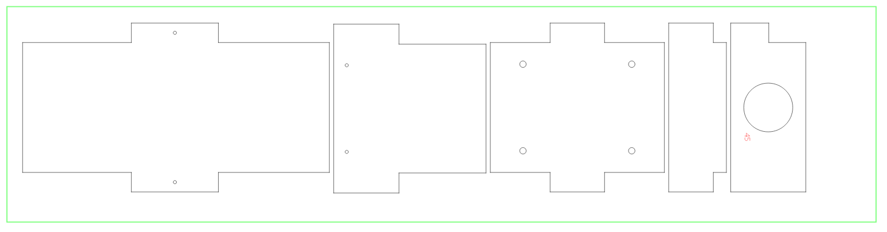
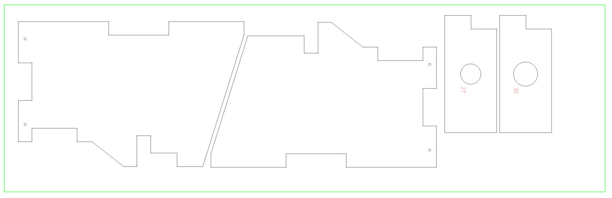

# Lasercutting

Es ist möglich, die Holzteile für den Vogelnistkasten mit einem Lasercutter zu schneiden. Allerdings sind nicht alle Lasercutter dafür geeignet.

Zunächst sollte sichergestellt werden, dass der Lasercutter in der Lage ist, 18 mm dicke Holzbretter aus Fichtenholz zu schneiden. Hierfür muss die Bedienungsanleitung des Lasercutter geprüft oder beim Hersteller des Lasercutter nachgefragt werden. In diesem Projekt wurde ein CO2-Lasercutter mit 130 W Laserleistung eingesetzt. Bei Lasercuttern mit weniger Leistung muss genau geprüft bzw. getestet werden, ob die Holzbretter durchgeschnitten werden können.

In unserem Fall haben wir ein Lasercutter-Modell Omtech Max 1493 / USB1410b (130 Watt) benutzt. Die Fertigung war erfolgreich, wenn auch mit ein paar Komplikationen verbunden, z.B. gingen manche Schnitte nicht ganz durch, sodass mit einer Stichsäge nachgesägt werden musste. Zudem waren die Kanten/Ränder relativ stark verbrannt und schwarz, sodass wir viel mit Tellerschleifer und Schleifpapier nacharbeiten mussten. Auch die Rauchentwicklung beim Lasercutting war recht stark, eine gute Abluftanlage wird auf jeden Fall benötigt.

Daher wird eher das CNC-Fräsen empfohlen (Beschreibung siehe [hier](../../Documentation/Fertigung_der_Holzteile/Fertigung_der_Holzteile.md)), das deutlich weniger Probleme macht. Es kann auch sein, dass andere Lasercutter oder andere Einstellungen zu besseren Ergebnissen führen - daher gerne ausprobieren und bei Erfolg freuen wir uns über eine Rückmeldung.

Im Folgenden wird beispielhaft eine Möglichkeit des Lasercuttings der Teile beschrieben. Die Teile wurden auf zwei Bretter Fichtenholz (800 x 200 x 18 mm und 800 x 250 x 18 mm) verteilt. Das Lasercutter-Modell war ein Omtech Max 1493 / USB1410b (130 Watt) unter Verwendung der Software "Lightburn".

## Sicherheit

Es wird dringend empfohlen, vor Inbetriebnahe eines Lasercutters gängige Sicherheitsempfehlungen für Lasercutter zu beachten, z.B. einen CO2-Feuerlöscher sowie eine Löschdecke bereitzuhalten und sich mit der Anwendung vertraut zu machen. Sollte sich während des Laserschneidens eine unkontrollierte Flamme über das Holzbrett ausbreiten, sollte der Laserjob gestoppt werden. Falls die Flammen nicht kurzfristig von alleine erlöschen, sollten sie mit einer Löschdecke oder mit einem CO2-Feuerlöscher gelöscht werden.

Das Lasercutten von 18 mm dicken Holzbrettern ist grundsätzlich möglich, allerdings relativ anspruchsvoll. Nach unseren Tests liegen 18 mm Brettstärke nahe der Grenze dessen, was mit Lasercutting von Holz möglich ist. Während des Laserschneidens ist damit zu rechnen, dass Flammen entstehen (vor allem bei harzhaltigem Holz wie Fichte). Ein "Air Assist"-System sowie eine gute Abluft- und Filteranlage mit hohem Volumenstrom sind dringend zu empfehlen, damit die Flamme unter Kontrolle bleibt bzw. kurzfristig ausgeblasen werden kann und damit die entstehenden Rauchgase zuverlässig abgeführt werden können.

Das Schneiden von Kunststoffplatten haben wir getestet, es führte jedoch nicht zu guten Ergebnissen und zu starker Rauchbildung. Es wird davon abgeraten, Kunststoffteile mit dem Lasercutter zu schneiden. Stattdessen sollten Kunststoffplatten entweder mit Kreissägen oder mit der CNC-Fräse bearbeitet werden - mehr dazu im Dokument "Fertigung der Kunststoffteile".

## Laser-Parameter

Bei dem o.g. Modell (Omtech Max 1493 / USB1410b (130 Watt)) werden folgende Einstellungen empfohlen:

- Schneiden:
  - Leistung: 35 %
  - Geschwindigkeit: 6 mm/s
  - Anzahl der Schnittdurchläufe: 2
- Gravieren:
  - Leistung: 15 %
  - Geschwindigkeit: 50 mm/s
 
Die Anzahl der Schnittdurchläufe ist hier mit zwei (2) angegeben. Dies kann z.B. in Lightburn über den Parameter "Anzahl der Durchläufe" gesteuert werden. Es wird allerdings empfohlen, den Parameter auf 1 zu setzen und dafür den Laserjob zwei mal hintereinander durchlaufen zu lassen. Andernfalls werden alle Linien direkt hintereinander zwei mal geschnitten, was die Gefahr von Flammbildung erhöht.
 
In den [herunterladbaren SVG-Dateien](../) sind Schnittlinien schwarz und Gravuren rot angelegt. In der Software Lightburn können die Parameter entsprechend angepasst werden. Der grüne Rand in den Abbildungen unten stellt das Brett dar und sollte nicht gelasert werden.

Die roten (gravierten) Zahlen stehen für den Lochdurchmesser in Millimeter. Für einen Nistkästen können alle drei Lochplatten angefertigt werden, damit sie später ausgetauscht werden können, oder es wird nur die Lochplatte gefertigt, die benötigt wird. Mehr zu dem Thema im Kapitel "Hintergrundinfos".
 
## Schmales Brett (20 cm Breite)

Für das schmale Brett mit 20 cm Breite (800 x 200 x 18 mm) wird folgende Anordnung empfohlen:

- Schwarz = Schnittlinien
- Rot = Gravur
- Grün = Brettrand (nicht lasern)

Die SVG-Datei kann [hier](../) heruntergeladen werden.

## Breites Brett (25 cm Breite)

Für das schmale Brett mit 20 cm Breite (800 x 250 x 18 mm) wird folgende Anordnung empfohlen:

Die SVG-Datei kann hier [hier](../) heruntergeladen werden.

## Nachbearbeitung

Nach unserer Erfahrung kommt es gelegentlich vor, dass Teile noch im Holzbrett feststecken, da Schnittlinien teilweise nicht ganz durchgingen. In dem Fall ist es ggf. notwendig, die Teile z.B. mit einer Stichsäge nachzusägen.

Die Ränder der Teile sind durch das Lasercutting oft stark verbrannt und schwarz. Es wird empfohlen, die Randpartien der Teile abzuschleifen, z.B. an einem Tellerschleifer und/oder mit Schleifpapier.
