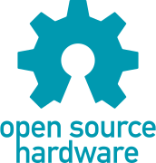

# Vogelnistkasten aus Recycling-Kunststoff und Holz - für Bauworkshops

Dieser Vogelnistkasten wurde so konzipiert, dass er einige Teile aus Recycling-Kunststoff (Plastikplatten aus der "Precious-Plastic"-Plattenpresse) und Wände sowie der Boden aus Holzplatten bestehen. Die Holzteile lassen sich mit einem geeigneten Lasercutter ausschneiden oder auch mit einer CNC-Fräse sehr gut aus Holzbrettern fräsen.

Durch seinen einfachen Aufbau ist dieser Nistkasten sehr gut für Bauworkshops geeignet, sowohl für Grundschulkinder als auch für ältere Jugendliche oder Erwachsene.

(Bild)

## Bauanleitung

Für einen Nachbau wird empfohlen, die folgenden Kapitel in der vorgesehenen Reihenfolge zu lesen und die Schritte entsprechend abzuarbeiten:

1. 💡 [Hintergrundinfos](Documentation/Hintergrundinfos/Hintergrundinfos.md)
2. 🛒 [Einkaufsliste](Documentation/Einkaufsliste/Einkaufsliste.md)
3. 🪵 [Fertigung der Holzteile (Lasercutting oder CNC-Fräsen)](Documentation/Fertigung_der_Holzteile/Fertigung_der_Holzteile.md)
4. ♻️ [Fertigung der Kunststoffteile](Documentation/Fertigung_der_Kunststoffteile/Fertigung_der_Kunststoffteile.md)
5. 🛠️ [Zusammenbau](Documentation/Documentation.md)
6. 🐣 Aufhängung der Kästen und Pflege

## CAD + Open Source

Dieser Nistkasten wurde in der Open-Source-Software FreeCAD entwickelt. Die Datei kann im Ordner CAD heruntergeladen werden:

- [Download der CAD-Datei (FreeCAD)](CAD)

Die Software FreeCAD ist kostenlos und kann auf https://www.freecad.org/ heruntergeladen werden:

- [Download der Software FreeCAD](https://www.freecad.org/)

Alle Bauteile und Objekte in der CAD-Datei des Nistkastens können mit FreeCAD verändert werden, sodass es möglich ist, weitere Varianten zu entwickeln und ggf. öffentlich zu teilen, so wie dieses Projekt - ganz im Sinne von Open Source Hardware.

## Lizenz

Das Design, die CAD-Dateien, die Materiallisten und alle dazugehörigen Dateien dieses Vogelnistkastens sind unter folgender Lizenz veröffentlicht:

- [CERN Open Hardware Licence Version 2 Weakly Reciprocal - CERN-OHL-W](https://cern-ohl.web.cern.ch/)

Die Dokumentation, Bauanleitung, Abbildungen und Texte in diesem Verzeichnis sind unter folgender Lizenz veröffentlicht:

- [Creative-Commons-Attribution-ShareAlike 4.0 International - CC BY-SA 4.0](http://creativecommons.org/licenses/by-sa/4.0/)

**Autor:** Oskar Lidtke, https://github.com/orcular-org/

 Except where otherwise noted, this work is licensed under a <a rel="license" href="http://creativecommons.org/licenses/by-sa/4.0/">Creative Commons Attribution-ShareAlike 4.0 International License (CC BY-SA 4.0)</a>.

Für die empfohlene, korrekte Anwendung der Creative-Commons-Namensnennung (engl. "attribution"), siehe [hier](https://wiki.creativecommons.org/wiki/Best_practices_for_attribution) und für die Kennzeichnung der eigenen Arbeit mit Creative Commons, siehe [hier](https://wiki.creativecommons.org/wiki/Marking_your_work_with_a_CC_license).

<i>  Open Source Hardware logo, <a href="https://creativecommons.org/licenses/by-sa/4.0/">CC BY-SA</a> - <a href="https://www.oshwa.org/open-source-hardware-logo/">Source</a> </i>

